# arc42 Documentation: Pragmatic UX Design Website

## Table of Contents

1. [Introduction and Goals](#1-introduction-and-goals)
2. [Constraints](#2-constraints)
3. [Context and Scope](#3-context-and-scope)
4. [Solution Strategy](#4-solution-strategy)
5. [Building Block View](#5-building-block-view)
6. [Runtime View](#6-runtime-view)
7. [Deployment View](#7-deployment-view)
8. [Cross-Cutting Concepts](#8-cross-cutting-concepts)
9. [Architectural Decisions](#9-architectural-decisions)
10. [Quality Requirements](#10-quality-requirements)
11. [Risks and Technical Debt](#11-risks-and-technical-debt)
12. [Glossary](#12-glossary)

---

## 1. Introduction and Goals

### 1.1 Requirements

**Objective:**
The Pragmatic UX Design website presents a practical framework for UX Design, communicating eight core principles and providing an interactive Decision Helper to assist users in selecting relevant principles for their specific situation.

**Core Features:**
- Presentation of eight UX Design principles with detailed explanations
- Interactive Decision Helper with question-answer flow
- Responsive design for all devices
- Decision Helper state persistence
- Email integration for result sharing

**Target Audience:**
- UX Designers and Product Managers
- Development teams seeking to integrate UX methods
- Stakeholders looking for pragmatic UX approaches

### 1.2 Quality Goals

| Quality Goal | Priority | Description |
|--------------|----------|-------------|
| Performance | High | Fast load times, optimized bundle size |
| Usability | Very High | Intuitive navigation, clear information architecture |
| Responsiveness | Very High | Optimal display on all devices |
| Accessibility | High | WCAG compliant, keyboard navigation |
| Maintainability | High | Clean code structure, TypeScript typing |

### 1.3 Stakeholders

| Role | Interest |
|------|----------|
| Patrick Federi (Author) | Framework presentation, lead generation |
| End Users | Understanding principles, practical application |
| Developers | Maintainability, extensibility |

---

## 2. Constraints

### 2.1 Technical Constraints

- **Framework**: Next.js 15.1.5 (App Router)
- **Runtime**: Node.js 18+
- **Deployment**: Vercel (optimized), compatible with other Node.js hosting platforms
- **Browser**: Modern browsers (Chrome, Firefox, Safari, Edge)

### 2.2 Organizational Constraints

- **License**: MIT License
- **Maintenance**: Patrick Federi (Ergon Informatik AG)
- **Deployment**: Automatic via Vercel on Git push

### 2.3 Conventions

- **Code Style**: ESLint with Next.js config
- **Styling**: Tailwind CSS utility-first
- **Typing**: TypeScript with strict mode
- **Git**: Conventional commits

---

## 3. Context and Scope

### 3.1 Business Context

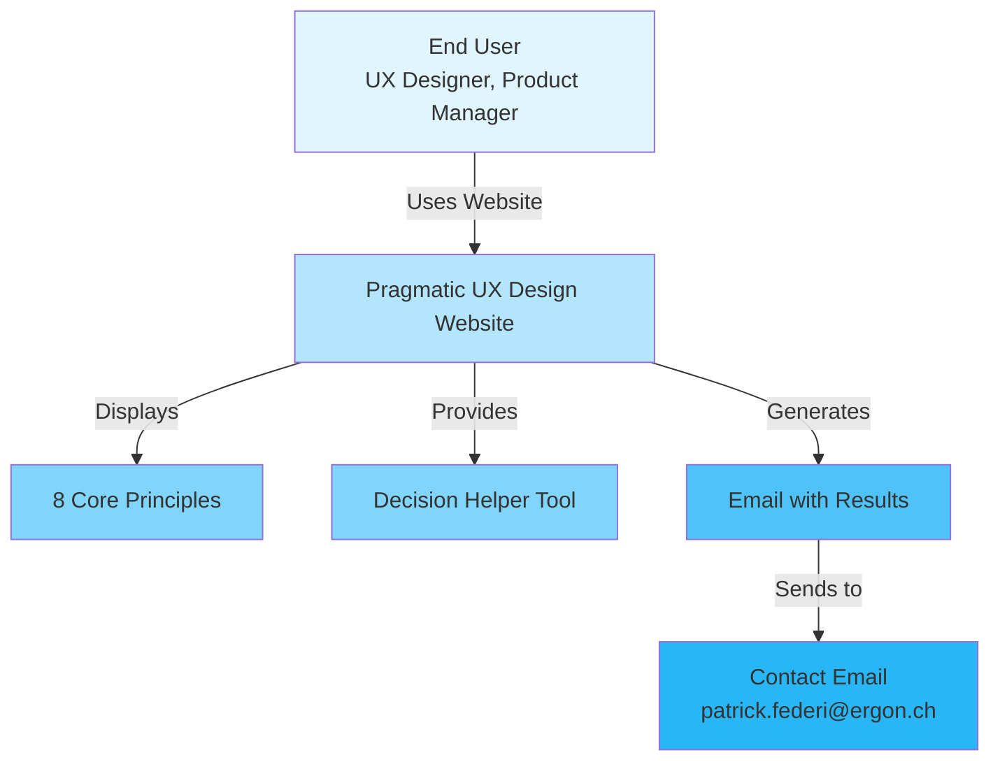

### 3.2 Technical Context

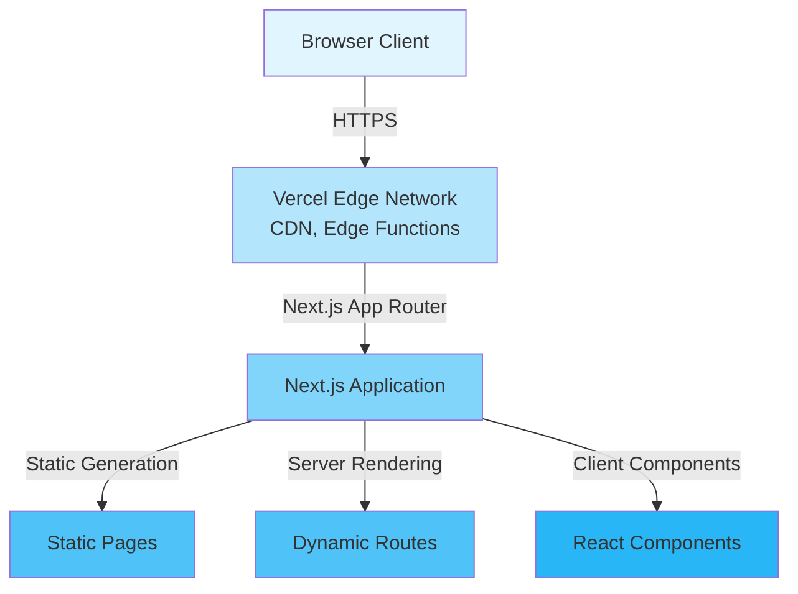

### 3.3 System Boundaries

**In Scope:**
- Website presentation and navigation
- Decision Helper interactive tool
- Principle detail pages
- Responsive design
- Client-side state persistence

**Out of Scope:**
- Backend API
- User authentication
- Database storage
- Analytics tracking
- Multi-language support (currently)

---

## 4. Solution Strategy

### 4.1 Architecture Style

- **Pattern**: Server-Side Rendering (SSR) with Static Site Generation (SSG)
- **Architecture**: Component-Based Architecture (React)
- **Styling**: Utility-First CSS (Tailwind)
- **State Management**: React Hooks (useState, useEffect, localStorage)

### 4.2 Technology Decisions

| Technology | Decision | Rationale |
|------------|----------|-----------|
| Next.js 15 | App Router | Modern React framework, optimal performance, SEO |
| TypeScript | Strict Mode | Type safety, better developer experience |
| Tailwind CSS | Utility-First | Fast development, consistent design |
| localStorage | Client-Side Persistence | Persistence without backend |

---

## 5. Building Block View

### 5.1 Level 1: Overall System

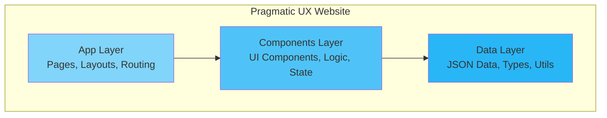

### 5.2 Level 2: App Layer

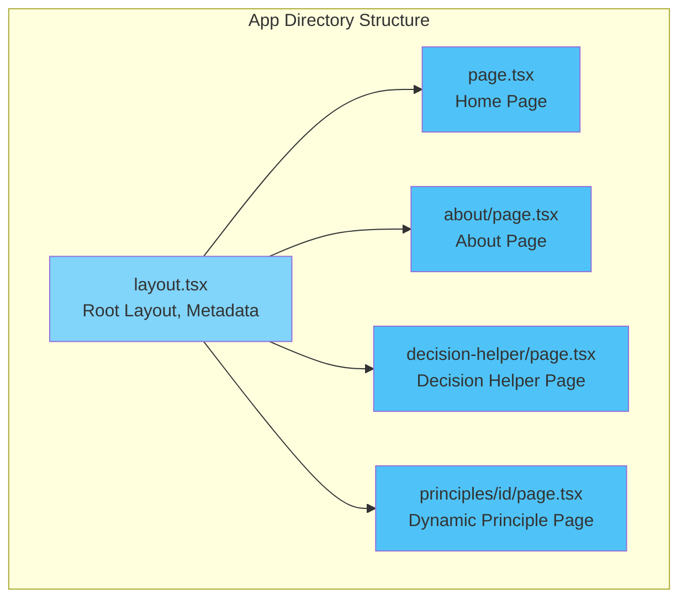

**Responsibilities:**
- **layout.tsx**: Root layout, metadata, global configuration
- **page.tsx**: Homepage with Hero, Workflow, Principles Overview
- **about/page.tsx**: About page with framework information
- **decision-helper/page.tsx**: Wrapper for Decision Helper component
- **principles/[id]/page.tsx**: Dynamic route for individual principles

### 5.3 Level 3: Components Layer

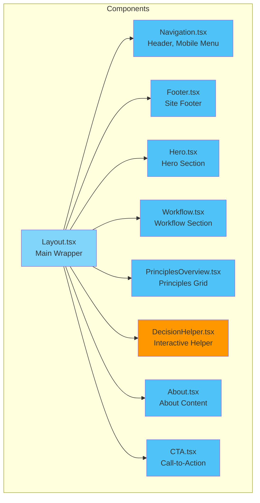

**Component Responsibilities:**

| Component | Responsibility |
|-----------|----------------|
| **Layout** | Wrapper for Navigation and Footer |
| **Navigation** | Header with Desktop/Mobile navigation, Principles dropdown |
| **Footer** | Site footer with copyright and links |
| **Hero** | Hero section with CTA buttons |
| **Workflow** | "The Pragmatic UX Design Approach" section |
| **PrinciplesOverview** | Grid view of all principles |
| **DecisionHelper** | Interactive Q&A flow, result display, state management |
| **About** | About page with Origin, Philosophy, Team info |
| **CTA** | Call-to-action with email link |

### 5.4 Decision Helper Component - Detailed View

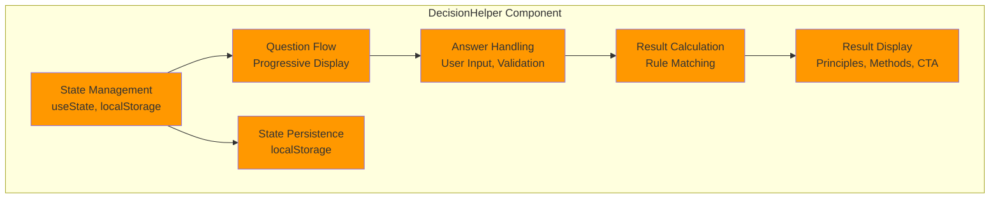

**Decision Helper Features:**

1. **Question Flow**
   - Progressive question display (one at a time)
   - Progress indicator (percentage)
   - Back navigation support
   - Question counter (X of Y)

2. **Answer Management**
   - Single-select options
   - Answer editing without restart
   - Answer persistence in localStorage
   - Answer validation

3. **Result Calculation**
   - Rule matching against decision tree
   - Multiple rule combinations
   - Principle recommendations (up to 3)
   - Method suggestions

4. **Result Display**
   - User situation summary (editable)
   - Recommended principles (with links)
   - Suggested methods with detailed instructions (modal popup)
   - Email integration (pre-filled template)
   - Start Over functionality

5. **Method Details Modal**
   - Clickable method cards with hover effects
   - Glassmorphism design with backdrop blur
   - Gradient glow effect around modal border
   - Step-by-step implementation instructions
   - Practical tips for each method
   - Direct contact integration

5. **State Persistence**
   - localStorage key: `decisionHelper_state`
   - Saves: current question index, user answers, results
   - Restores on page reload
   - Clears on "Start Over"

### 5.5 Level 4: Data Layer

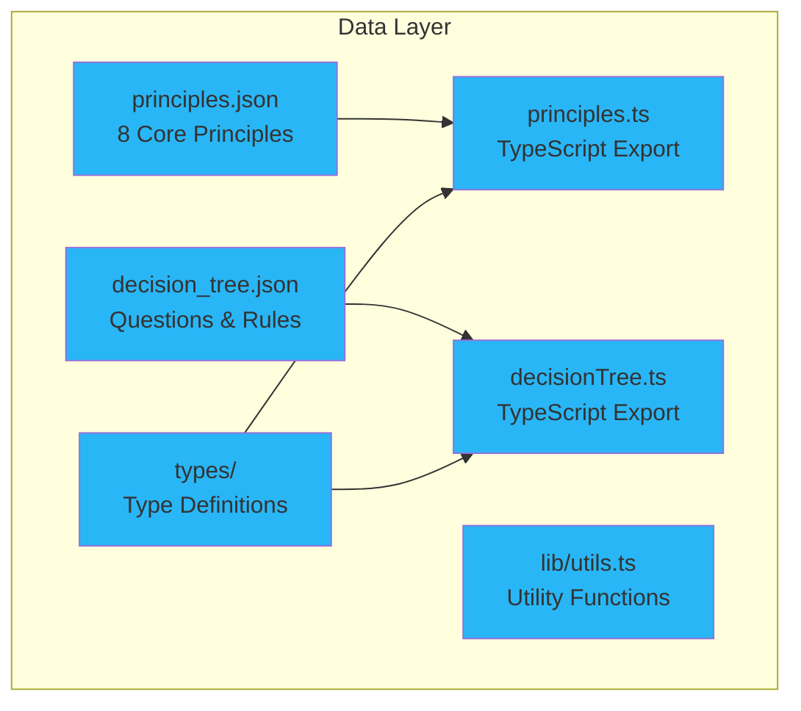

**Data Structures:**

- **principles.json**: Array of 8 principles with title, summary, examples, etc.
- **methods.json**: Detailed method instructions with steps and tips for modal display
- **decision_tree.json**: Questions and rules for Decision Helper
- **types/**: TypeScript interfaces for type safety

---

## 6. Runtime View

### 6.1 Scenario: Homepage Visit

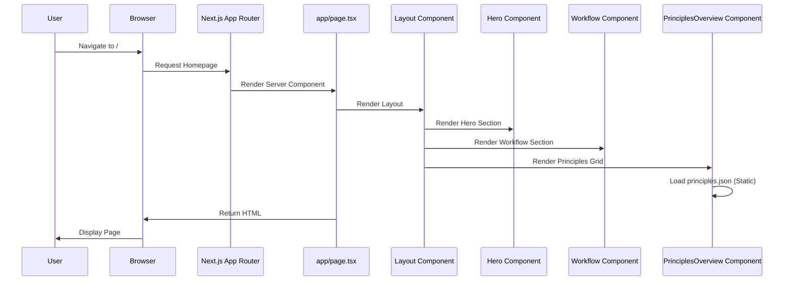

### 6.2 Scenario: Decision Helper Flow

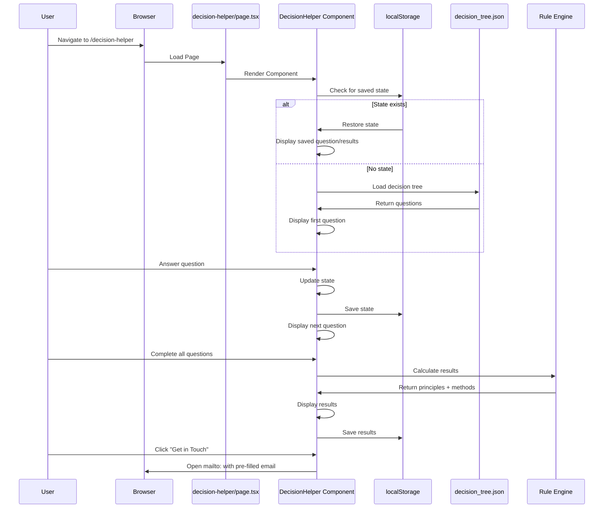

### 6.3 Scenario: Principle Detail Page

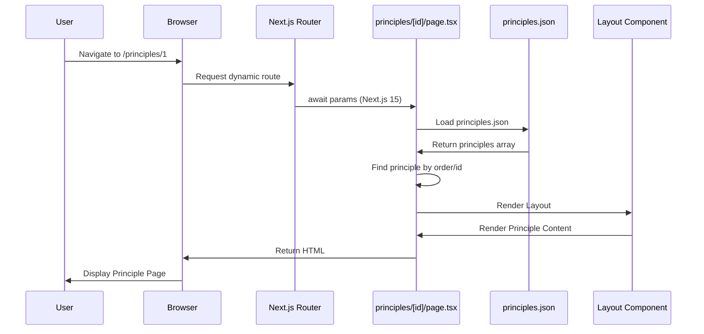

---

## 7. Deployment View

### 7.1 Deployment Architecture

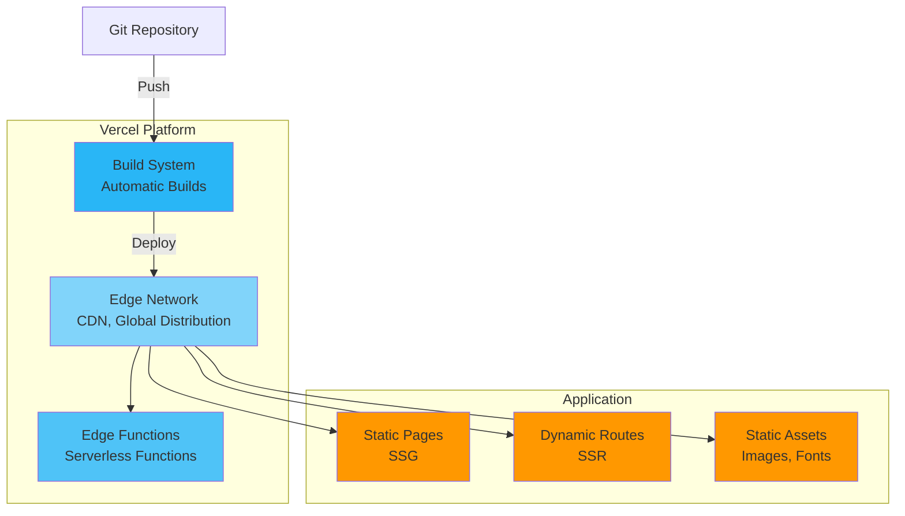

### 7.2 Client-Server Distribution

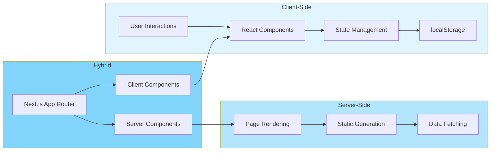

---

## 8. Cross-Cutting Concepts

### 8.1 Styling Concept

**Tailwind CSS Utility-First:**
- Responsive breakpoints: `sm:`, `md:`, `lg:`, `xl:`
- Custom color scheme via CSS variables
- Dark mode support (class-based)
- Consistent spacing scale

**Glassmorphism Design:**
- Backdrop blur effects (`backdrop-blur-md`)
- Semi-transparent backgrounds (`bg-card/95`)
- Subtle borders (`border-white/30`)
- Gradient glow effects around modals
- Modern, premium visual effects

**Design System:**
- Primary Colors: Blue/Purple Gradient with Glassmorphism accents
- Typography: Inter Font Family
- Spacing: Tailwind Default Scale
- Components: Reusable Card, Button Patterns with glassmorphism variants

### 8.2 State Management

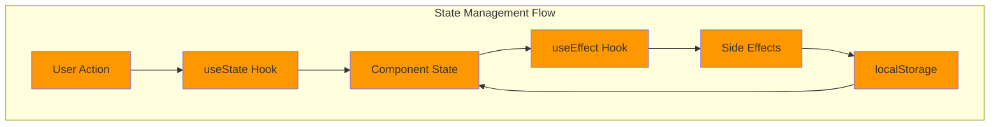

**React Hooks:**
- `useState`: Component state (Decision Helper, Navigation)
- `useEffect`: Side effects (localStorage, click-outside)
- `useRef`: DOM references (dropdowns)

**Persistence:**
- `localStorage`: Decision Helper state
- Key: `decisionHelper_state`
- Structure: `{ currentQuestionIndex, userAnswers, results, showResults, isEditing }`

### 8.3 Error Handling

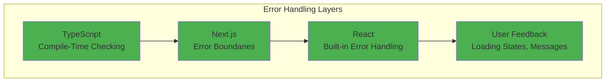

- **TypeScript**: Compile-time type checking
- **Next.js**: Error boundaries (implicit)
- **User Feedback**: Loading states, error messages

### 8.4 Security

- **XSS Prevention**: React's built-in escaping
- **CSRF**: Not applicable (static site)
- **Content Security**: Next.js defaults
- **Email Links**: `mailto:` protocol (client-side)

### 8.5 Performance

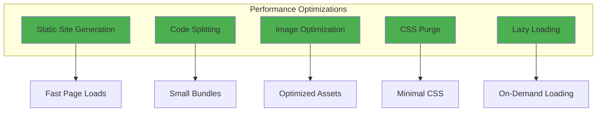

**Optimizations:**
- Static Site Generation (SSG) for principle pages
- Code splitting via Next.js App Router
- Image optimization (Next.js Image component)
- CSS optimization (Tailwind purge)

**Lazy Loading:**
- Client components only where needed
- Dynamic imports for large components (if needed)

---

## 9. Architectural Decisions

### ADR-1: Next.js App Router

**Status:** Accepted

**Context:** Modern React framework selection for website

**Decision:** Next.js 15 with App Router instead of Pages Router

**Consequences:**
- ✅ Server Components by default
- ✅ Better performance
- ✅ Modern API
- ⚠️ Learning curve for team
- ⚠️ Breaking changes on updates

### ADR-2: TypeScript

**Status:** Accepted

**Context:** Type safety for codebase

**Decision:** TypeScript with strict mode

**Consequences:**
- ✅ Type safety
- ✅ Better IDE support
- ✅ Refactoring safety
- ⚠️ More boilerplate

### ADR-3: Tailwind CSS

**Status:** Accepted

**Context:** Styling approach

**Decision:** Utility-first CSS with Tailwind

**Consequences:**
- ✅ Fast development
- ✅ Consistent design
- ✅ Small bundle size (purge)
- ⚠️ HTML can become cluttered

### ADR-4: Client-Side State Persistence

**Status:** Accepted

**Context:** Decision Helper state persistence

**Decision:** localStorage instead of backend

**Consequences:**
- ✅ No backend needed
- ✅ Fast implementation
- ✅ No server costs
- ⚠️ Only client-side available
- ⚠️ No cross-device sync

### ADR-5: Decision Helper Architecture

**Status:** Accepted

**Context:** Interactive tool for principle selection

**Decision:** Client-side rule engine with JSON-based decision tree

**Consequences:**
- ✅ No backend API needed
- ✅ Fast rule evaluation
- ✅ Easy to update rules (JSON file)
- ⚠️ All logic in client bundle
- ⚠️ Limited complexity for rules

### ADR-6: Modal Design with Glassmorphism

**Status:** Accepted

**Context:** Enhanced user experience for method details display

**Decision:** Modal overlay with glassmorphism effects and gradient glow

**Consequences:**
- ✅ Modern, premium visual appeal
- ✅ Better focus on content with backdrop blur
- ✅ Improved accessibility with clear modal hierarchy
- ✅ Enhanced brand perception through polished UI
- ⚠️ Slightly increased bundle size due to additional CSS classes
- ⚠️ Requires modern browser support for backdrop-blur

---

## 10. Quality Requirements

### 10.1 Performance

| Metric | Target | Measurement |
|--------|--------|-------------|
| First Contentful Paint | < 1.5s | Lighthouse |
| Time to Interactive | < 3s | Lighthouse |
| Bundle Size | < 200KB (gzipped) | Build Output |

### 10.2 Usability

- **Navigation**: Clear structure, mobile-first
- **Content**: Understandable texts, clear CTAs
- **Decision Helper**: Intuitive flow, editability

### 10.3 Accessibility

The website is fully compliant with **WCAG 2.1 Level AA** standards, ensuring accessibility for all users including those using assistive technologies.

#### 10.3.1 WCAG Compliance

- **Level**: WCAG 2.1 Level AA
- **Color Contrast**: Minimum 4.5:1 for normal text, 3:1 for large text (18pt+ or 14pt+ bold)
- **Text Alternatives**: All images include descriptive alt text
- **Keyboard Accessible**: All functionality available via keyboard
- **Focus Indicators**: Visible focus states on all interactive elements

#### 10.3.2 Semantic HTML

- Proper use of semantic elements: `<nav>`, `<main>`, `<section>`, `<article>`, `<footer>`
- Logical heading hierarchy (h1 → h2 → h3)
- Form labels associated with inputs
- Landmark regions for screen reader navigation

#### 10.3.3 ARIA Implementation

**Navigation:**
- Dropdown menus with `aria-expanded`, `aria-haspopup="true"`, `aria-controls`
- Menu items with `role="menu"` and `role="menuitem"`
- Active page indication with `aria-current="page"`
- Mobile menu with proper ARIA relationships

**Decision Helper:**
- Progress bar with `role="progressbar"`, `aria-valuenow`, `aria-valuemin`, `aria-valuemax`
- Radio button groups with `role="radiogroup"` and `aria-labelledby`
- Individual options with `role="radio"` and `aria-checked` states
- Question labels linked via `aria-labelledby`

**Interactive Elements:**
- All buttons have descriptive `aria-label` attributes
- Links to external resources include "(opens in new tab)" in aria-label
- Decorative icons and animations marked with `aria-hidden="true"`
- Skip-to-main-content link for keyboard users

#### 10.3.4 Keyboard Navigation

- **Tab Navigation**: All interactive elements accessible via Tab key
- **Enter/Space**: Buttons and links activatable via Enter or Space
- **Arrow Keys**: Dropdown menus support arrow key navigation
- **Escape**: Dropdowns can be closed with Escape key
- **Focus Management**: Focus properly managed in modals and dynamic content
- **Focus Indicators**: Visible focus rings (2px primary color ring with offset) on all focusable elements

#### 10.3.5 Color Contrast

**Text Contrast:**
- Foreground on background: 98% lightness on 4.9% lightness (exceeds requirements)
- Muted foreground: 75% lightness (ensures 4.5:1+ contrast on dark backgrounds)
- Primary text on background: 53.3% lightness on 4.9% lightness (meets requirements)

**UI Components:**
- Borders and focus indicators meet 3:1 contrast requirement
- Interactive states (hover, focus) maintain sufficient contrast
- Progress bars and status indicators are clearly visible

#### 10.3.6 Screen Reader Support

- All content is accessible via screen readers (NVDA, JAWS, VoiceOver)
- Form inputs have associated labels
- Error messages are announced
- Dynamic content changes are announced
- Decorative elements are hidden from screen readers

#### 10.3.7 Implementation Details

**Components with Accessibility Features:**

1. **Navigation.tsx**
   - Dropdown menus with full ARIA support
   - Mobile menu with proper roles
   - Active state indication
   - Keyboard navigation support

2. **DecisionHelper.tsx**
   - Accessible progress indicator
   - Radio button group implementation
   - Form controls with labels
   - Results announcement

3. **Layout.tsx**
   - Skip-to-main-content link
   - Main landmark with id for skip link target

4. **Hero.tsx**
   - Decorative animations marked as decorative
   - Links with descriptive labels

5. **All Components**
   - Focus states on all interactive elements
   - Proper heading hierarchy
   - Semantic HTML structure

#### 10.3.8 Testing Recommendations

- Test with screen readers (NVDA, JAWS, VoiceOver)
- Keyboard-only navigation testing
- Color contrast validation tools
- Automated accessibility testing (axe, Lighthouse)
- Manual testing with assistive technologies

### 10.4 Browser Compatibility

- Chrome (last 2 versions)
- Firefox (last 2 versions)
- Safari (last 2 versions)
- Edge (last 2 versions)

---

## 11. Risks and Technical Debt

### 11.1 Risks

| Risk | Probability | Impact | Mitigation |
|------|-------------|--------|------------|
| Next.js Breaking Changes | Medium | High | Regular updates, tests |
| Browser Compatibility | Low | Medium | Polyfills, fallbacks |
| Performance Degradation | Low | Medium | Monitoring, optimization |

### 11.2 Technical Debt

- **Testing**: No unit/integration tests present
- **Error Handling**: No explicit error boundaries
- **Analytics**: No tracking implementation
- **i18n**: English only, no internationalization

### 11.3 Improvement Potential

- **Testing**: Jest + React Testing Library
- **Monitoring**: Vercel Analytics or similar
- **i18n**: next-intl for multi-language support
- **CMS**: Contentful/Strapi for principle management

---

## 12. Glossary

| Term | Definition |
|------|------------|
| **App Router** | Next.js 13+ routing system with `app/` directory |
| **Server Component** | React component rendered on server |
| **Client Component** | React component rendered in browser |
| **SSG** | Static Site Generation - pages generated at build time |
| **SSR** | Server-Side Rendering - pages generated on request |
| **Decision Helper** | Interactive tool to identify relevant UX principles |
| **localStorage** | Browser API for client-side data storage |
| **Tailwind CSS** | Utility-first CSS framework |
| **TypeScript** | Typed JavaScript |
| **Vercel** | Deployment platform for Next.js apps |
| **Rule Engine** | Logic that matches user answers to decision tree rules |
| **State Persistence** | Saving application state across sessions |

---

## Appendix

### A. Dependencies

**Production Dependencies:**
- next: ^15.1.5
- react: ^19.2.1
- react-dom: ^19.2.1
- tailwindcss: ^3.4.0

**Development Dependencies:**
- typescript: ^5.9.3
- eslint: ^8.57.0
- @types/node, @types/react, @types/react-dom
- autoprefixer, postcss

### B. Build Process

```bash
# Development
npm run dev

# Production Build
npm run build

# Production Start
npm start

# Linting
npm run lint
```

### C. Deployment Process

1. Code push to Git repository
2. Vercel automatically detects Next.js
3. Build process runs automatically
4. Deployment to Edge Network
5. CDN invalidation

### D. Decision Helper State Structure

```typescript
interface DecisionHelperState {
  currentQuestionIndex: number;
  userAnswers: Record<string, string>;
  results: {
    principles: string[];
    methods: string[];
  } | null;
  showResults: boolean;
  isEditing: boolean;
}
```

### E. Decision Tree Rule Structure

```typescript
interface DecisionTreeRule {
  if: Partial<Record<string, string>>;
  then: {
    principles: string[];
    methods: string[];
  };
}
```

---

**Documentation Version:** 1.1
**Last Updated:** 2025-12-16
**Author:** Patrick Federi


