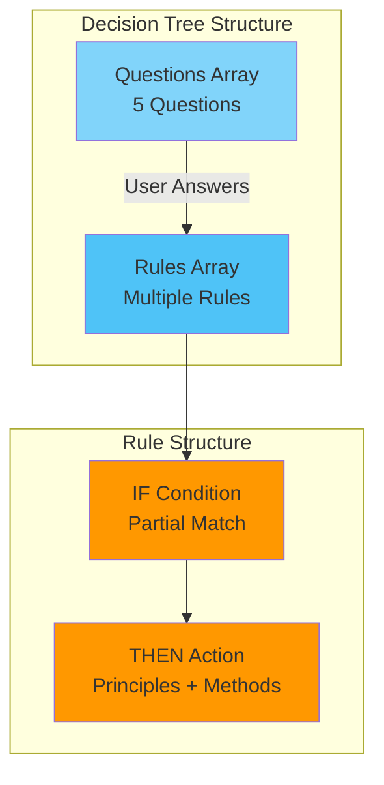
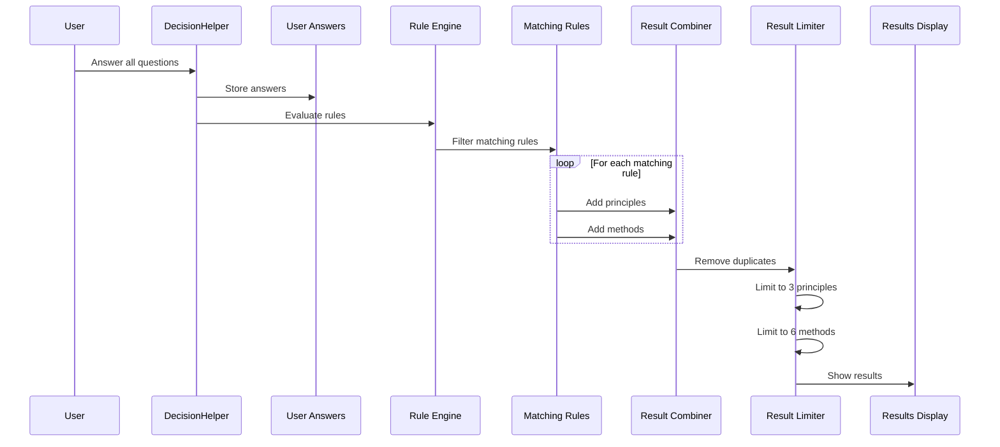
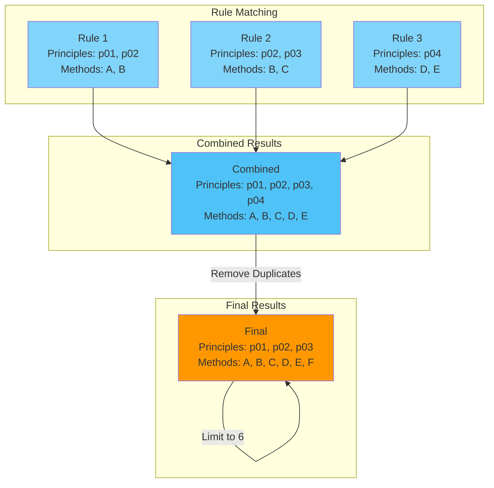
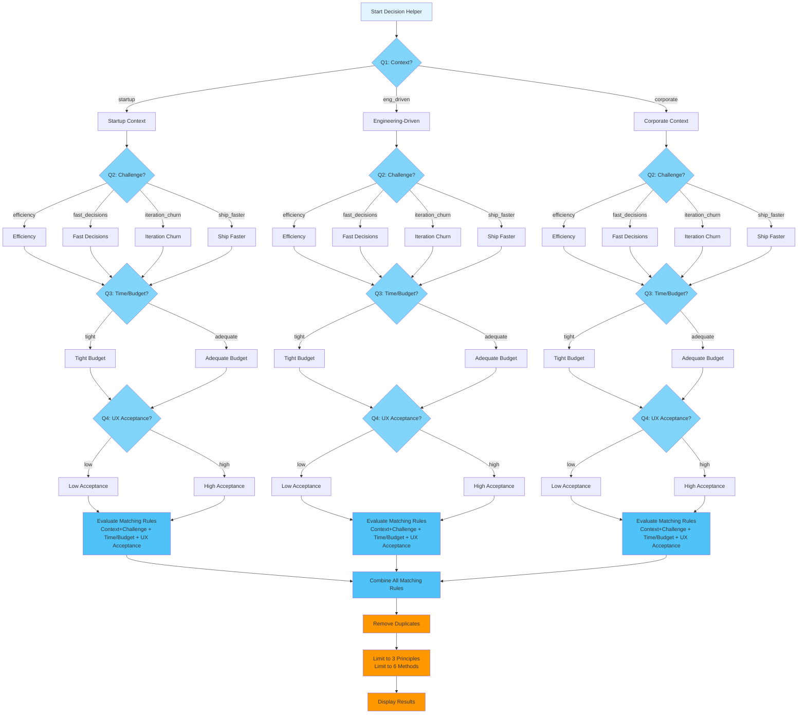
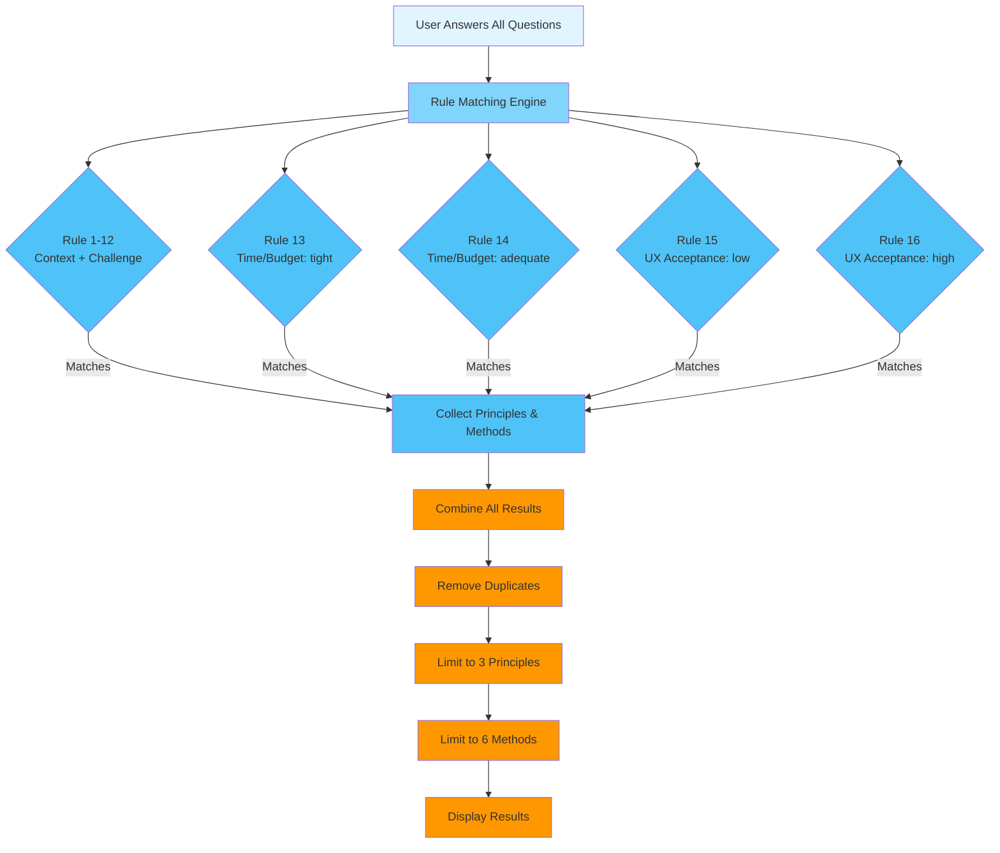
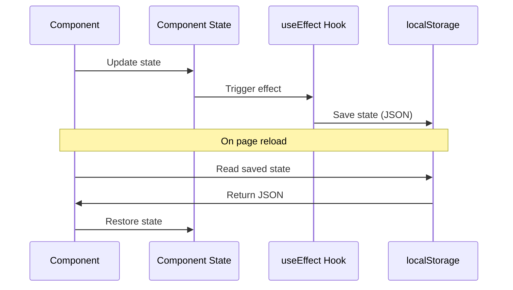
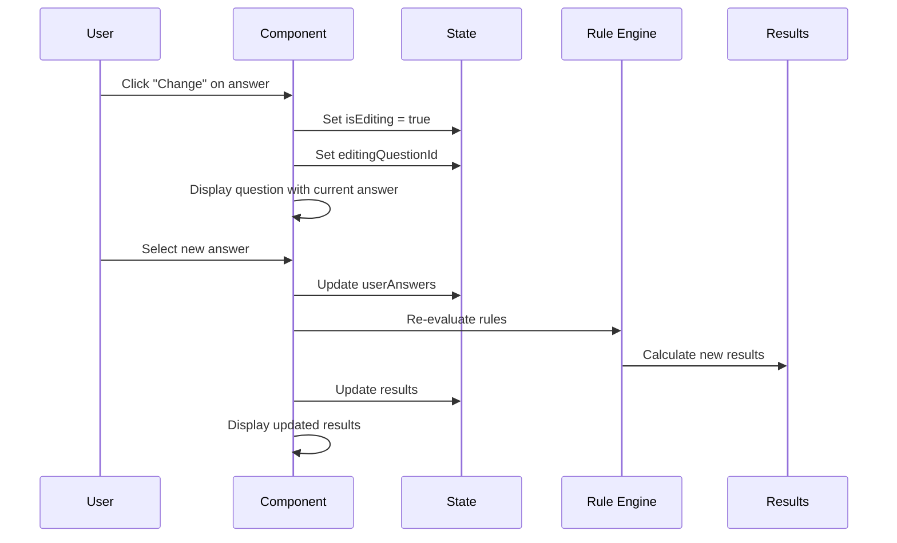

# Decision Helper Logic Documentation

## Table of Contents

1. [Overview](#1-overview)
2. [Rule Engine Architecture](#2-rule-engine-architecture)
3. [Rule Evaluation Process](#3-rule-evaluation-process)
4. [Result Calculation](#4-result-calculation)
5. [Rule Matching Examples](#5-rule-matching-examples)
6. [Question Flow](#6-question-flow)
7. [State Management](#7-state-management)

---

## 1. Overview

The Decision Helper uses a **rule-based decision tree** to match user answers to relevant UX Design principles and methods. The system evaluates multiple rules simultaneously and combines their results to provide personalized recommendations.

### Key Concepts

- **Questions**: 5 questions about the user's project context
- **Rules**: Conditional logic that maps answers to principles and methods
- **Results**: Up to 3 principles and up to 6 methods based on matching rules

---

## 2. Rule Engine Architecture

### 2.1 Data Structure



### 2.2 Rule Format

Each rule in `decision_tree.json` follows this structure:

```typescript
interface DecisionTreeRule {
  if: Partial<Record<string, string>>;  // Conditions (partial match)
  then: {
    principles: string[];  // Principle IDs (e.g., "p01", "p02")
    methods: string[];     // Method names (e.g., "Guerrilla Testing")
  };
}
```

**Key Characteristics:**
- **Partial Match**: Rules can match on any subset of questions
- **Multiple Rules**: Multiple rules can match simultaneously
- **Combined Results**: All matching rules contribute to final results

---

## 3. Rule Evaluation Process

### 3.1 Evaluation Flow



### 3.2 Rule Matching Algorithm

The matching algorithm uses **AND logic** for each rule's conditions:

```typescript
const matchingRules = decisionTree.rules.filter((rule) => {
  return Object.entries(rule.if).every(([key, value]) => {
    return answers[key] === value
  })
})
```

**How it works:**
1. Iterate through all rules
2. For each rule, check if **all** conditions in `rule.if` match user answers
3. If all conditions match, the rule is included
4. Multiple rules can match simultaneously

**Example:**
```json
{
  "if": { "context": "startup", "challenge": "efficiency" },
  "then": {
    "principles": ["p02", "p01"],
    "methods": ["Task Flow Redesign", "Checkout Simplification"]
  }
}
```

This rule matches if:
- `answers.context === "startup"` **AND**
- `answers.challenge === "efficiency"`

---

## 4. Result Calculation

### 4.1 Complete Rule Reference

The decision tree contains **19 rules** total. Each rule has a unique condition and contributes principles and methods when matched.

| Rule # | Condition (IF) | Principles | Methods | Used in Examples |
|--------|----------------|-----------|---------|------------------|
| **1** | `context: "startup"` AND `challenge: "efficiency"` | p02, p01 | Task Flow Redesign, Checkout Simplification, Performance Audits | Example 1 |
| **2** | `context: "startup"` AND `challenge: "fast_decisions"` | p03, p05, p04 | One-Page Findings, Rapid Usability Audit, Guerrilla Testing, Sketching Sessions | Example 2 |
| **3** | `context: "startup"` AND `challenge: "iteration_churn"` | p07, p02 | Impact Mapping, Top-3 Friction Fix, Focused A/B Testing | Example 8 |
| **4** | `context: "startup"` AND `challenge: "ship_faster"` | p08, p01 | Design System Adoption, Component Reuse, Design Tokens | Example 5 |
| **5** | `context: "eng_driven"` AND `challenge: "efficiency"` | p01, p02 | Co-Design with Devs, Constraint-First Wireframes, Performance Budgets | Example 4 |
| **6** | `context: "eng_driven"` AND `challenge: "fast_decisions"` | p03, p04 | Tech-Feasibility Notes, One-Pager Decision Logs, Rapid UX Audits | - |
| **7** | `context: "eng_driven"` AND `challenge: "iteration_churn"` | p07 | UX Bug Bash, Top-3 UX Debt List, Canary Releases | Example 7 |
| **8** | `context: "eng_driven"` AND `challenge: "ship_faster"` | p08, p01 | Shared Component Libraries, Design Tokens, Pattern Documentation | Example 10 |
| **9** | `context: "corporate"` AND `challenge: "efficiency"` | p02, p06 | Workflow Simplification, Contextual Inquiry, Task Analysis | Example 9 |
| **10** | `context: "corporate"` AND `challenge: "fast_decisions"` | p03, p05 | Executive Summaries, Rapid Testing, Stakeholder Workshops | Example 6 |
| **11** | `context: "corporate"` AND `challenge: "iteration_churn"` | p07, p06 | Goal-Oriented Roadmaps, Top-3 Metrics Dashboards, Prioritization Workshops | Example 3 |
| **12** | `context: "corporate"` AND `challenge: "ship_faster"` | p08, p06 | Enterprise Design System, Cross-Team Libraries, Reusable Templates | - |
| **13** | `time_budget: "tight"` | p05, p04 | Guerrilla Testing, Rapid Prototyping, Lean Personas | Examples 2, 4, 6, 8, 10 |
| **14** | `time_budget: "adequate"` | p06 | Deep Interviews, Usability Labs, Cross-Functional Workshops | Examples 3, 5, 7, 9 |
| **15** | `ux_acceptance: "low"` | p01, p03 | Lightweight Deliverables, Embedded UX Sessions, Sketch Reviews | Examples 2, 4, 6, 8 |
| **16** | `ux_acceptance: "high"` | p07, p08 | Continuous Testing, Design System Scaling, Component Governance | Examples 1, 3, 5, 7, 9, 10 |
| **17** | `project_phase: "project_start"` | p06, p03 | Contextual Inquiry, Task Analysis, Stakeholder Workshops, Prioritization Workshops | - |
| **18** | `project_phase: "project_middle"` | p02, p01 | Design Studio, Sketch Reviews, Rapid Prototyping, Usability Labs | - |
| **19** | `project_phase: "project_end"` | p08, p07 | Performance Audits, Top-3 Friction Fix, Canary Releases, Checkout Simplification | - |

**Note:** Rules are evaluated in order (1-19), and **all matching rules** contribute to the final results. Multiple rules can match simultaneously.

### 4.2 Rule Matching Matrix

This matrix shows which rules match for each combination of answers. For brevity, showing a sample:

| Context | Challenge | Time/Budget | UX Acceptance | Matching Rules |
|---------|-----------|-------------|---------------|----------------|
| startup | efficiency | tight | high | **1**, **13**, **16** |
| startup | fast_decisions | tight | low | **2**, **13**, **15** |
| eng_driven | efficiency | tight | low | **5**, **13**, **15** |
| corporate | iteration_churn | adequate | high | **11**, **14**, **16** |

**Key:**
- **Bold numbers** = Context + Challenge rule (1-12)
- **13** = Time/Budget: tight rule
- **14** = Time/Budget: adequate rule
- **15** = UX Acceptance: low rule
- **16** = UX Acceptance: high rule

### 4.3 Combining Multiple Rules



### 4.4 Result Processing Steps

```typescript
// Step 1: Collect all principles and methods from matching rules
const combinedResults: DecisionTreeResults = {
  principles: [],
  methods: [],
}

matchingRules.forEach((rule) => {
  if (rule.then.principles) {
    combinedResults.principles.push(...rule.then.principles)
  }
  if (rule.then.methods) {
    combinedResults.methods.push(...rule.then.methods)
  }
})

// Step 2: Remove duplicates
combinedResults.principles = [...new Set(combinedResults.principles)]
combinedResults.methods = [...new Set(combinedResults.methods)]

// Step 3: Limit results
combinedResults.principles = combinedResults.principles.slice(0, 3)
combinedResults.methods = combinedResults.methods.slice(0, 6)
```

**Processing Order:**
1. **Collect**: Gather all principles and methods from matching rules
2. **Deduplicate**: Remove duplicate entries using `Set`
3. **Limit**: Keep only first 3 principles and first 6 methods

---

## 5. Rule Matching Examples

### 5.1 Example 1: Single Rule Match

**User Answers:**
- `context: "startup"`
- `challenge: "efficiency"`
- `time_budget: "tight"`
- `ux_acceptance: "high"`

**Matching Rules:** **Rule 1**, **Rule 13**, **Rule 16**

**Result:**
- **Principles**: p02, p01, p05 (3 principles after deduplication and limiting)
- **Methods**: Task Flow Redesign, Checkout Simplification, Performance Audits, Guerrilla Testing, Rapid Prototyping, Lean Personas (6 methods)

---

### 5.2 Example 2: Multiple Rule Match

**User Answers:**
- `context: "startup"`
- `challenge: "fast_decisions"`
- `time_budget: "tight"`
- `ux_acceptance: "low"`

**Matching Rules:** **Rule 2**, **Rule 13**, **Rule 15**

**Final Results:**
- **Principles**: p03, p05, p04 (3 principles - p01 dropped due to limit)
- **Methods**: One-Page Findings, Rapid Usability Audit, Guerrilla Testing, Sketching Sessions, Rapid Prototyping, Lean Personas (6 methods)

---

### 5.3 Example 3: Partial Rule Match

**User Answers:**
- `context: "corporate"`
- `challenge: "iteration_churn"`
- `time_budget: "adequate"`
- `ux_acceptance: "high"`

**Matching Rules:** **Rule 11**, **Rule 14**, **Rule 16**

**Final Results:**
- **Principles**: p07, p06, p08 (3 principles)
- **Methods**: Goal-Oriented Roadmaps, Top-3 Metrics Dashboards, Prioritization Workshops, Deep Interviews, Usability Labs, Cross-Functional Workshops (6 methods)

---

## 6. Question Flow

### 6.1 Decision Tree Visualization

The following decision tree shows the complete flow from questions to results:



### 6.2 Simplified Decision Tree

A simplified view showing the rule matching logic:



### 6.3 Question Details

| Question ID | Label | Options |
|-------------|-------|---------|
| `context` | What type of project environment are you working in? | startup, eng_driven, corporate |
| `challenge` | What is your biggest current challenge? | efficiency, fast_decisions, iteration_churn, ship_faster |
| `time_budget` | How are your time and budget constraints? | tight, adequate |
| `ux_acceptance` | How high is the UX acceptance in your team? | low, high |
| `project_phase` | What phase of the project are you currently in? | project_start, project_middle, project_end |

### 6.4 Progress Calculation

```typescript
const progress = currentQuestionIndex === 0 
  ? 0 
  : Math.round((currentQuestionIndex / questions.length) * 100)
```

**Progress Indicator:**
- **0%**: Before answering first question
- **20%**: After answering Q1
- **40%**: After answering Q2
- **60%**: After answering Q3
- **80%**: After answering Q4
- **100%**: After answering Q5 (results shown)

---

## 7. State Management

### 7.1 State Structure

```typescript
interface DecisionHelperState {
  currentQuestionIndex: number;        // Current question (0-4)
  userAnswers: Record<string, string>; // Map of questionId -> answer value
  results: DecisionTreeResults | null; // Calculated results
  showResults: boolean;                // Whether to show results
  isEditing: boolean;                  // Whether user is editing answers
}
```

### 7.2 State Persistence

**localStorage Key:** `decisionHelper_state`

**Persistence Logic:**
- State is saved to `localStorage` whenever it changes
- State is restored on component mount
- State is cleared when user clicks "Start Over"

**Persistence Flow:**



### 7.3 Answer Editing Flow



**Editing Behavior:**
- User can edit any answer without restarting
- Results are recalculated immediately after answer change
- Editing mode allows continuous refinement
- All changes are persisted to localStorage

---

## 8. Rule Categories

### 8.1 Context-Based Rules

Rules that match based on project context:

- **Startup Context**: Fast-paced, resource-constrained environments
- **Engineering-Driven**: Technical teams with strong engineering culture
- **Corporate**: High-risk, compliance-focused organizations

### 8.2 Challenge-Based Rules

Rules that match based on specific challenges:

- **Efficiency**: Improving user efficiency
- **Fast Decisions**: Need for quick stakeholder decisions
- **Iteration Churn**: Too much iteration without progress
- **Ship Faster**: Need to ship features faster

### 8.3 Constraint-Based Rules

Rules that match based on constraints:

- **Time/Budget**: Tight vs. adequate resources
- **UX Acceptance**: Low vs. high team acceptance

### 8.4 Rule Combinations

Rules can combine multiple conditions:

- **Context + Challenge**: Most specific rules (e.g., "startup + efficiency")
- **Single Condition**: Broader rules (e.g., "time_budget: tight")
- **Multiple Matches**: Multiple rules can match simultaneously

---

## 9. Result Display Logic

### 9.1 Principle Display

```typescript
results.principles.forEach((principleId) => {
  const principle = getPrincipleById(principleId)
  // Display principle with link to detail page
})
```

**Display Format:**
- Principle order number (1-8)
- Principle title
- Link to `/principles/[id]` page

### 9.2 Method Display

```typescript
results.methods.forEach((method) => {
  const description = getMethodDescription(method)
  // Display method card with description
})
```

**Display Format:**
- Method name
- Method description (from hardcoded descriptions)
- Card-based layout

### 9.3 Email Integration

The results are formatted into a pre-filled email:

```typescript
const emailBody = `
My Situation:
- Question 1: Answer 1
- Question 2: Answer 2
...

Recommended Principles:
- 1. Principle Title
- 2. Principle Title
...

Suggested Methods:
- Method 1
- Method 2
...
`
```

---

## 10. Algorithm Complexity

### 10.1 Time Complexity

- **Rule Matching**: O(n × m) where n = number of rules, m = average conditions per rule
- **Result Combination**: O(k) where k = number of matching rules
- **Deduplication**: O(p + q) where p = principles count, q = methods count
- **Overall**: O(n × m + k + p + q) ≈ **O(n × m)** (linear in practice)

### 10.2 Space Complexity

- **State Storage**: O(1) - fixed number of questions
- **Results Storage**: O(1) - max 3 principles, 6 methods
- **localStorage**: O(1) - fixed size JSON string
- **Overall**: **O(1)** - constant space

---

## 11. Testing Scenarios

### 11.1 Edge Cases

1. **No Matching Rules**: Should return empty results (shouldn't happen with current rule set)
2. **All Rules Match**: Should combine all principles/methods, then limit
3. **Duplicate Principles**: Should be removed before limiting
4. **More than 3 Principles**: Should limit to first 3
5. **More than 6 Methods**: Should limit to first 6

### 11.2 Validation

- All questions must be answered before results are shown
- Answers must match valid option values
- Results are always recalculated when answers change
- State persistence works across page reloads

---

## Appendix

### A. Rule Count Statistics

- **Total Rules**: 16 rules
- **Context + Challenge Rules**: 12 rules (3 contexts × 4 challenges)
- **Time/Budget Rules**: 2 rules
- **UX Acceptance Rules**: 2 rules

### B. Principle Mapping

| Principle ID | Principle Title |
|--------------|----------------|
| p01 | UX Should Fit the Process |
| p02 | Efficiency Over Delight |
| p03 | Empower, Not Overcomplicate |
| p04 | Theory Is Nice, but Execution Wins |
| p05 | Research Should Be Right-Sized |
| p06 | Scale to Product Needs |
| p07 | Iterate with Purpose |
| p08 | Reuse Design Systems |

### C. Method Descriptions

All method descriptions are hardcoded in `DecisionHelper.tsx` in the `getMethodDescription` function. See component code for complete list.

---

**Documentation Version:** 2.0
**Last Updated:** 2025-12-17
**Author:** Patrick Federi

---

## Changelog

### Version 2.0 (December 2025)

#### New Features
- **5th Question Added**: Project phase question (start/middle/end) with 3 new rules
- **Project Phase Prioritization**: Phase-specific rules get higher priority in results
- **Expanded Method Set**: Updated to 64 methods total (removed duplicates, added analytics methods)

#### Rule Engine Updates
- **19 Total Rules**: Increased from 16 rules with 3 new project phase rules
- **Prioritized Matching**: Project phase rules are processed first for guaranteed inclusion
- **Enhanced Logic**: `unshift()` method ensures phase-specific methods appear in top 6 results

#### Content Updates
- **New Methods**: Design Studio, Analytics Audit, Conversion Funnel Analysis, User Segmentation Analysis
- **Method Renaming**: "Field Studies" → "Contextual Inquiry"
- **Duplicate Removal**: Cleaned up Testing & Validation and Implementation categories

#### Technical Improvements
- **Progress Calculation**: Updated from 25% to 20% per question (5 questions total)
- **State Management**: Enhanced question indexing (0-4 instead of 0-3)
- **Rule Matching**: Improved algorithm for multi-rule scenarios
