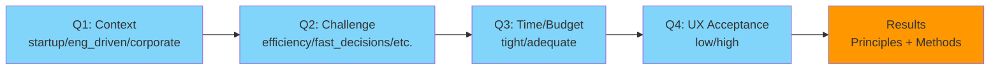

# Decision Helper Logic Documentation

## Table of Contents

1. [Overview](#1-overview)
2. [Rule Engine Architecture](#2-rule-engine-architecture)
3. [Rule Evaluation Process](#3-rule-evaluation-process)
4. [Result Calculation](#4-result-calculation)
5. [Rule Matching Examples](#5-rule-matching-examples)
6. [Question Flow](#6-question-flow)
7. [State Management](#7-state-management)

---

## 1. Overview

The Decision Helper uses a **rule-based decision tree** to match user answers to relevant UX Design principles and methods. The system evaluates multiple rules simultaneously and combines their results to provide personalized recommendations.

### Key Concepts

- **Questions**: 4 questions about the user's project context
- **Rules**: Conditional logic that maps answers to principles and methods
- **Results**: Up to 3 principles and up to 6 methods based on matching rules

---

## 2. Rule Engine Architecture

### 2.1 Data Structure


### 2.2 Rule Format

Each rule in `decision_tree.json` follows this structure:

```typescript
interface DecisionTreeRule {
  if: Partial<Record<string, string>>;  // Conditions (partial match)
  then: {
    principles: string[];  // Principle IDs (e.g., "p01", "p02")
    methods: string[];     // Method names (e.g., "Guerrilla Testing")
  };
}
```

**Key Characteristics:**
- **Partial Match**: Rules can match on any subset of questions
- **Multiple Rules**: Multiple rules can match simultaneously
- **Combined Results**: All matching rules contribute to final results

---

## 3. Rule Evaluation Process

### 3.1 Evaluation Flow


### 3.2 Rule Matching Algorithm

The matching algorithm uses **AND logic** for each rule's conditions:

```typescript
const matchingRules = decisionTree.rules.filter((rule) => {
  return Object.entries(rule.if).every(([key, value]) => {
    return answers[key] === value
  })
})
```

**How it works:**
1. Iterate through all rules
2. For each rule, check if **all** conditions in `rule.if` match user answers
3. If all conditions match, the rule is included
4. Multiple rules can match simultaneously

**Example:**
```json
{
  "if": { "context": "startup", "challenge": "efficiency" },
  "then": {
    "principles": ["p02", "p01"],
    "methods": ["Task Flow Redesign", "Checkout Simplification"]
  }
}
```

This rule matches if:
- `answers.context === "startup"` **AND**
- `answers.challenge === "efficiency"`

---

## 4. Result Calculation

### 4.1 Complete Rule Reference

The decision tree contains **15 rules** total. Each rule has a unique condition and contributes principles and methods when matched.

| Rule # | Condition (IF) | Principles | Methods | Used in Examples |
|--------|----------------|-----------|---------|------------------|
| **1** | `context: "startup"` AND `challenge: "efficiency"` | p02, p01 | Task Flow Redesign, Checkout Simplification, Performance Audits | Example 1 |
| **2** | `context: "startup"` AND `challenge: "fast_decisions"` | p03, p05, p04 | One-Page Findings, Rapid Usability Audit, Guerrilla Testing, Sketching Sessions | Example 2 |
| **3** | `context: "startup"` AND `challenge: "iteration_churn"` | p07, p02 | Impact Mapping, Top-3 Friction Fix, Focused A/B Testing | Example 8 |
| **4** | `context: "startup"` AND `challenge: "ship_faster"` | p08, p01 | Design System Adoption, Component Reuse, Design Tokens | Example 5 |
| **5** | `context: "eng_driven"` AND `challenge: "efficiency"` | p01, p02 | Co-Design with Devs, Constraint-First Wireframes, Performance Budgets | Example 4 |
| **6** | `context: "eng_driven"` AND `challenge: "fast_decisions"` | p03, p04 | Tech-Feasibility Notes, One-Pager Decision Logs, Rapid UX Audits | - |
| **7** | `context: "eng_driven"` AND `challenge: "iteration_churn"` | p07 | UX Bug Bash, Top-3 UX Debt List, Canary Releases | Example 7 |
| **8** | `context: "eng_driven"` AND `challenge: "ship_faster"` | p08, p01 | Shared Component Libraries, Design Tokens, Pattern Documentation | Example 10 |
| **9** | `context: "corporate"` AND `challenge: "efficiency"` | p02, p06 | Workflow Simplification, Field Studies, Task Analysis | Example 9 |
| **10** | `context: "corporate"` AND `challenge: "fast_decisions"` | p03, p05 | Executive Summaries, Rapid Testing, Stakeholder Workshops | Example 6 |
| **11** | `context: "corporate"` AND `challenge: "iteration_churn"` | p07, p06 | Goal-Oriented Roadmaps, Top-3 Metrics Dashboards, Prioritization Workshops | Example 3 |
| **12** | `context: "corporate"` AND `challenge: "ship_faster"` | p08, p06 | Enterprise Design System, Cross-Team Libraries, Reusable Templates | - |
| **13** | `time_budget: "tight"` | p05, p04 | Guerrilla Testing, Rapid Prototyping, Lean Personas | Examples 2, 4, 6, 8, 10 |
| **14** | `time_budget: "adequate"` | p06 | Deep Interviews, Usability Labs, Cross-Functional Workshops | Examples 3, 5, 7, 9 |
| **15** | `ux_acceptance: "low"` | p01, p03 | Lightweight Deliverables, Embedded UX Sessions, Sketch Reviews | Examples 2, 4, 6, 8 |
| **16** | `ux_acceptance: "high"` | p07, p08 | Continuous Testing, Design System Scaling, Component Governance | Examples 1, 3, 5, 7, 9, 10 |

**Note:** Rules are evaluated in order (1-16), and **all matching rules** contribute to the final results. Multiple rules can match simultaneously.

### 4.2 Rule Matching Matrix

This matrix shows which rules match for each combination of answers:

| Context | Challenge | Time/Budget | UX Acceptance | Matching Rules |
|---------|-----------|-------------|---------------|----------------|
| startup | efficiency | tight | high | **1**, **13**, **16** |
| startup | efficiency | tight | low | **1**, **13**, **15** |
| startup | efficiency | adequate | high | **1**, **14**, **16** |
| startup | efficiency | adequate | low | **1**, **14**, **15** |
| startup | fast_decisions | tight | high | **2**, **13**, **16** |
| startup | fast_decisions | tight | low | **2**, **13**, **15** |
| startup | fast_decisions | adequate | high | **2**, **14**, **16** |
| startup | fast_decisions | adequate | low | **2**, **14**, **15** |
| startup | iteration_churn | tight | high | **3**, **13**, **16** |
| startup | iteration_churn | tight | low | **3**, **13**, **15** |
| startup | iteration_churn | adequate | high | **3**, **14**, **16** |
| startup | iteration_churn | adequate | low | **3**, **14**, **15** |
| startup | ship_faster | tight | high | **4**, **13**, **16** |
| startup | ship_faster | tight | low | **4**, **13**, **15** |
| startup | ship_faster | adequate | high | **4**, **14**, **16** |
| startup | ship_faster | adequate | low | **4**, **14**, **15** |
| eng_driven | efficiency | tight | high | **5**, **13**, **16** |
| eng_driven | efficiency | tight | low | **5**, **13**, **15** |
| eng_driven | efficiency | adequate | high | **5**, **14**, **16** |
| eng_driven | efficiency | adequate | low | **5**, **14**, **15** |
| eng_driven | fast_decisions | tight | high | **6**, **13**, **16** |
| eng_driven | fast_decisions | tight | low | **6**, **13**, **15** |
| eng_driven | fast_decisions | adequate | high | **6**, **14**, **16** |
| eng_driven | fast_decisions | adequate | low | **6**, **14**, **15** |
| eng_driven | iteration_churn | tight | high | **7**, **13**, **16** |
| eng_driven | iteration_churn | tight | low | **7**, **13**, **15** |
| eng_driven | iteration_churn | adequate | high | **7**, **14**, **16** |
| eng_driven | iteration_churn | adequate | low | **7**, **14**, **15** |
| eng_driven | ship_faster | tight | high | **8**, **13**, **16** |
| eng_driven | ship_faster | tight | low | **8**, **13**, **15** |
| eng_driven | ship_faster | adequate | high | **8**, **14**, **16** |
| eng_driven | ship_faster | adequate | low | **8**, **14**, **15** |
| corporate | efficiency | tight | high | **9**, **13**, **16** |
| corporate | efficiency | tight | low | **9**, **13**, **15** |
| corporate | efficiency | adequate | high | **9**, **14**, **16** |
| corporate | efficiency | adequate | low | **9**, **14**, **15** |
| corporate | fast_decisions | tight | high | **10**, **13**, **16** |
| corporate | fast_decisions | tight | low | **10**, **13**, **15** |
| corporate | fast_decisions | adequate | high | **10**, **14**, **16** |
| corporate | fast_decisions | adequate | low | **10**, **14**, **15** |
| corporate | iteration_churn | tight | high | **11**, **13**, **16** |
| corporate | iteration_churn | tight | low | **11**, **13**, **15** |
| corporate | iteration_churn | adequate | high | **11**, **14**, **16** |
| corporate | iteration_churn | adequate | low | **11**, **14**, **15** |
| corporate | ship_faster | tight | high | **12**, **13**, **16** |
| corporate | ship_faster | tight | low | **12**, **13**, **15** |
| corporate | ship_faster | adequate | high | **12**, **14**, **16** |
| corporate | ship_faster | adequate | low | **12**, **14**, **15** |

**Key:**
- **Bold numbers** = Context + Challenge rule (1-12)
- **13** = Time/Budget: tight rule
- **14** = Time/Budget: adequate rule
- **15** = UX Acceptance: low rule
- **16** = UX Acceptance: high rule

**Example:** For `startup + fast_decisions + tight + low`, rules **2**, **13**, and **15** match, contributing:
- From Rule 2: p03, p05, p04 + 4 methods
- From Rule 13: p05, p04 + 3 methods
- From Rule 15: p01, p03 + 3 methods
- **Combined**: p03, p05, p04, p01 (4 principles) → limited to 3: p03, p05, p04
- **Combined**: 10 methods → deduplicated → limited to 6

### 4.3 Combining Multiple Rules


### 4.4 Result Processing Steps

```typescript
// Step 1: Collect all principles and methods from matching rules
const combinedResults: DecisionTreeResults = {
  principles: [],
  methods: [],
}

matchingRules.forEach((rule) => {
  if (rule.then.principles) {
    combinedResults.principles.push(...rule.then.principles)
  }
  if (rule.then.methods) {
    combinedResults.methods.push(...rule.then.methods)
  }
})

// Step 2: Remove duplicates
combinedResults.principles = [...new Set(combinedResults.principles)]
combinedResults.methods = [...new Set(combinedResults.methods)]

// Step 3: Limit results
combinedResults.principles = combinedResults.principles.slice(0, 3)
combinedResults.methods = combinedResults.methods.slice(0, 6)
```

**Processing Order:**
1. **Collect**: Gather all principles and methods from matching rules
2. **Deduplicate**: Remove duplicate entries using `Set`
3. **Limit**: Keep only first 3 principles and first 6 methods

---

## 5. Rule Matching Examples

### 5.1 Example 1: Single Rule Match

**User Answers:**
- `context: "startup"`
- `challenge: "efficiency"`
- `time_budget: "tight"`
- `ux_acceptance: "high"`

**Matching Rules:** **Rule 1**, **Rule 13**, **Rule 16**

**Rule 1** (Context + Challenge):
```json
{
  "if": { "context": "startup", "challenge": "efficiency" },
  "then": {
    "principles": ["p02", "p01"],
    "methods": ["Task Flow Redesign", "Checkout Simplification", "Performance Audits"]
  }
}
```

**Rule 13** (Time/Budget: tight):
```json
{
  "if": { "time_budget": "tight" },
  "then": {
    "principles": ["p05", "p04"],
    "methods": ["Guerrilla Testing", "Rapid Prototyping", "Lean Personas"]
  }
}
```

**Rule 16** (UX Acceptance: high):
```json
{
  "if": { "ux_acceptance": "high" },
  "then": {
    "principles": ["p07", "p08"],
    "methods": ["Continuous Testing", "Design System Scaling", "Component Governance"]
  }
}
```

**Combined Results (before deduplication):**
- **Principles**: p02, p01, p05, p04, p07, p08 (6 entries)
- **Methods**: Task Flow Redesign, Checkout Simplification, Performance Audits, Guerrilla Testing, Rapid Prototyping, Lean Personas, Continuous Testing, Design System Scaling, Component Governance (9 entries)

**Final Results (after deduplication and limiting):**
- **Principles**: p02, p01, p05 (3 principles - p04, p07, p08 dropped due to limit)
- **Methods**: Task Flow Redesign, Checkout Simplification, Performance Audits, Guerrilla Testing, Rapid Prototyping, Lean Personas (6 methods)

---

### 5.2 Example 2: Multiple Rule Match

**User Answers:**
- `context: "startup"`
- `challenge: "fast_decisions"`
- `time_budget: "tight"`
- `ux_acceptance: "low"`

**Matching Rules:** **Rule 2**, **Rule 13**, **Rule 15**

**Rule 2** (Context + Challenge):
```json
{
  "if": { "context": "startup", "challenge": "fast_decisions" },
  "then": {
    "principles": ["p03", "p05", "p04"],
    "methods": ["One-Page Findings", "Rapid Usability Audit", "Guerrilla Testing", "Sketching Sessions"]
  }
}
```

**Rule 13** (Time/Budget: tight):
```json
{
  "if": { "time_budget": "tight" },
  "then": {
    "principles": ["p05", "p04"],
    "methods": ["Guerrilla Testing", "Rapid Prototyping", "Lean Personas"]
  }
}
```

**Rule 15** (UX Acceptance: low):
```json
{
  "if": { "ux_acceptance": "low" },
  "then": {
    "principles": ["p01", "p03"],
    "methods": ["Lightweight Deliverables", "Embedded UX Sessions", "Sketch Reviews"]
  }
}
```

**Combined Results (before deduplication):**
- **Principles**: p03, p05, p04, p05, p04, p01, p03 (7 entries)
- **Methods**: One-Page Findings, Rapid Usability Audit, Guerrilla Testing, Sketching Sessions, Guerrilla Testing, Rapid Prototyping, Lean Personas, Lightweight Deliverables, Embedded UX Sessions, Sketch Reviews (10 entries)

**Final Results (after deduplication and limiting):**
- **Principles**: p03, p05, p04, p01 (4 → limited to 3: p03, p05, p04)
- **Methods**: One-Page Findings, Rapid Usability Audit, Guerrilla Testing, Sketching Sessions, Rapid Prototyping, Lean Personas (6 methods)

---

### 5.3 Example 3: Partial Rule Match

**User Answers:**
- `context: "corporate"`
- `challenge: "iteration_churn"`
- `time_budget: "adequate"`
- `ux_acceptance: "high"`

**Matching Rules:** **Rule 11**, **Rule 14**, **Rule 16**

**Rule 11** (Context + Challenge):
```json
{
  "if": { "context": "corporate", "challenge": "iteration_churn" },
  "then": {
    "principles": ["p07", "p06"],
    "methods": ["Goal-Oriented Roadmaps", "Top-3 Metrics Dashboards", "Prioritization Workshops"]
  }
}
```

**Rule 14** (Time/Budget: adequate):
```json
{
  "if": { "time_budget": "adequate" },
  "then": {
    "principles": ["p06"],
    "methods": ["Deep Interviews", "Usability Labs", "Cross-Functional Workshops"]
  }
}
```

**Rule 16** (UX Acceptance: high):
```json
{
  "if": { "ux_acceptance": "high" },
  "then": {
    "principles": ["p07", "p08"],
    "methods": ["Continuous Testing", "Design System Scaling", "Component Governance"]
  }
}
```

**Final Results:**
- **Principles**: p07, p06, p08 (3 principles)
- **Methods**: Goal-Oriented Roadmaps, Top-3 Metrics Dashboards, Prioritization Workshops, Deep Interviews, Usability Labs, Cross-Functional Workshops (6 methods)

---

### 5.4 Example 4: Engineering-Driven Team

**User Answers:**
- `context: "eng_driven"`
- `challenge: "efficiency"`
- `time_budget: "tight"`
- `ux_acceptance: "low"`

**Matching Rules:** **Rule 5**, **Rule 13**, **Rule 15**

**Rule 5** (Context + Challenge):
```json
{
  "if": { "context": "eng_driven", "challenge": "efficiency" },
  "then": {
    "principles": ["p01", "p02"],
    "methods": ["Co-Design with Devs", "Constraint-First Wireframes", "Performance Budgets"]
  }
}
```

**Rule 13** (Time/Budget: tight):
```json
{
  "if": { "time_budget": "tight" },
  "then": {
    "principles": ["p05", "p04"],
    "methods": ["Guerrilla Testing", "Rapid Prototyping", "Lean Personas"]
  }
}
```

**Rule 15** (UX Acceptance: low):
```json
{
  "if": { "ux_acceptance": "low" },
  "then": {
    "principles": ["p01", "p03"],
    "methods": ["Lightweight Deliverables", "Embedded UX Sessions", "Sketch Reviews"]
  }
}
```

**Final Results:**
- **Principles**: p01, p02, p05 (3 principles - p01 appears twice but deduplicated, p04 and p03 dropped due to limit)
- **Methods**: Co-Design with Devs, Constraint-First Wireframes, Performance Budgets, Guerrilla Testing, Rapid Prototyping, Lean Personas (6 methods)

---

### 5.5 Example 5: Startup Shipping Faster

**User Answers:**
- `context: "startup"`
- `challenge: "ship_faster"`
- `time_budget: "adequate"`
- `ux_acceptance: "high"`

**Matching Rules:** **Rule 4**, **Rule 14**, **Rule 16**

**Rule 4** (Context + Challenge):
```json
{
  "if": { "context": "startup", "challenge": "ship_faster" },
  "then": {
    "principles": ["p08", "p01"],
    "methods": ["Design System Adoption", "Component Reuse", "Design Tokens"]
  }
}
```

**Rule 14** (Time/Budget: adequate):
```json
{
  "if": { "time_budget": "adequate" },
  "then": {
    "principles": ["p06"],
    "methods": ["Deep Interviews", "Usability Labs", "Cross-Functional Workshops"]
  }
}
```

**Rule 16** (UX Acceptance: high):
```json
{
  "if": { "ux_acceptance": "high" },
  "then": {
    "principles": ["p07", "p08"],
    "methods": ["Continuous Testing", "Design System Scaling", "Component Governance"]
  }
}
```

**Final Results:**
- **Principles**: p08, p01, p07 (3 principles - p08 appears twice but deduplicated, p06 dropped due to limit)
- **Methods**: Design System Adoption, Component Reuse, Design Tokens, Deep Interviews, Usability Labs, Cross-Functional Workshops (6 methods)

---

### 5.6 Example 6: Corporate Fast Decisions

**User Answers:**
- `context: "corporate"`
- `challenge: "fast_decisions"`
- `time_budget: "tight"`
- `ux_acceptance: "low"`

**Matching Rules:** **Rule 10**, **Rule 13**, **Rule 15**

**Rule 10** (Context + Challenge):
```json
{
  "if": { "context": "corporate", "challenge": "fast_decisions" },
  "then": {
    "principles": ["p03", "p05"],
    "methods": ["Executive Summaries", "Rapid Testing", "Stakeholder Workshops"]
  }
}
```

**Rule 13** (Time/Budget: tight):
```json
{
  "if": { "time_budget": "tight" },
  "then": {
    "principles": ["p05", "p04"],
    "methods": ["Guerrilla Testing", "Rapid Prototyping", "Lean Personas"]
  }
}
```

**Rule 15** (UX Acceptance: low):
```json
{
  "if": { "ux_acceptance": "low" },
  "then": {
    "principles": ["p01", "p03"],
    "methods": ["Lightweight Deliverables", "Embedded UX Sessions", "Sketch Reviews"]
  }
}
```

**Final Results:**
- **Principles**: p03, p05, p01 (3 principles - p05 appears twice but deduplicated, p04 dropped due to limit)
- **Methods**: Executive Summaries, Rapid Testing, Stakeholder Workshops, Guerrilla Testing, Rapid Prototyping, Lean Personas (6 methods)

---

### 5.7 Example 7: Engineering-Driven Iteration Churn

**User Answers:**
- `context: "eng_driven"`
- `challenge: "iteration_churn"`
- `time_budget: "adequate"`
- `ux_acceptance: "high"`

**Matching Rules:** **Rule 7**, **Rule 14**, **Rule 16**

**Rule 7** (Context + Challenge):
```json
{
  "if": { "context": "eng_driven", "challenge": "iteration_churn" },
  "then": {
    "principles": ["p07"],
    "methods": ["UX Bug Bash", "Top-3 UX Debt List", "Canary Releases"]
  }
}
```

**Rule 14** (Time/Budget: adequate):
```json
{
  "if": { "time_budget": "adequate" },
  "then": {
    "principles": ["p06"],
    "methods": ["Deep Interviews", "Usability Labs", "Cross-Functional Workshops"]
  }
}
```

**Rule 16** (UX Acceptance: high):
```json
{
  "if": { "ux_acceptance": "high" },
  "then": {
    "principles": ["p07", "p08"],
    "methods": ["Continuous Testing", "Design System Scaling", "Component Governance"]
  }
}
```

**Final Results:**
- **Principles**: p07, p06, p08 (3 principles - p07 appears twice but deduplicated)
- **Methods**: UX Bug Bash, Top-3 UX Debt List, Canary Releases, Deep Interviews, Usability Labs, Cross-Functional Workshops (6 methods - some methods from Rule 3 dropped due to limit)

---

### 5.8 Example 8: Startup Iteration Churn

**User Answers:**
- `context: "startup"`
- `challenge: "iteration_churn"`
- `time_budget: "tight"`
- `ux_acceptance: "low"`

**Matching Rules:** **Rule 3**, **Rule 13**, **Rule 15**

**Rule 3** (Context + Challenge):
```json
{
  "if": { "context": "startup", "challenge": "iteration_churn" },
  "then": {
    "principles": ["p07", "p02"],
    "methods": ["Impact Mapping", "Top-3 Friction Fix", "Focused A/B Testing"]
  }
}
```

**Rule 13** (Time/Budget: tight):
```json
{
  "if": { "time_budget": "tight" },
  "then": {
    "principles": ["p05", "p04"],
    "methods": ["Guerrilla Testing", "Rapid Prototyping", "Lean Personas"]
  }
}
```

**Rule 15** (UX Acceptance: low):
```json
{
  "if": { "ux_acceptance": "low" },
  "then": {
    "principles": ["p01", "p03"],
    "methods": ["Lightweight Deliverables", "Embedded UX Sessions", "Sketch Reviews"]
  }
}
```

**Final Results:**
- **Principles**: p07, p02, p05 (3 principles - p01, p03, p04 dropped due to limit)
- **Methods**: Impact Mapping, Top-3 Friction Fix, Focused A/B Testing, Guerrilla Testing, Rapid Prototyping, Lean Personas (6 methods)

---

### 5.9 Example 9: Corporate Efficiency

**User Answers:**
- `context: "corporate"`
- `challenge: "efficiency"`
- `time_budget: "adequate"`
- `ux_acceptance: "high"`

**Matching Rules:** **Rule 9**, **Rule 14**, **Rule 16**

**Rule 9** (Context + Challenge):
```json
{
  "if": { "context": "corporate", "challenge": "efficiency" },
  "then": {
    "principles": ["p02", "p06"],
    "methods": ["Workflow Simplification", "Field Studies", "Task Analysis"]
  }
}
```

**Rule 14** (Time/Budget: adequate):
```json
{
  "if": { "time_budget": "adequate" },
  "then": {
    "principles": ["p06"],
    "methods": ["Deep Interviews", "Usability Labs", "Cross-Functional Workshops"]
  }
}
```

**Rule 16** (UX Acceptance: high):
```json
{
  "if": { "ux_acceptance": "high" },
  "then": {
    "principles": ["p07", "p08"],
    "methods": ["Continuous Testing", "Design System Scaling", "Component Governance"]
  }
}
```

**Final Results:**
- **Principles**: p02, p06, p07 (3 principles - p06 appears twice but deduplicated, p08 dropped due to limit)
- **Methods**: Workflow Simplification, Field Studies, Task Analysis, Deep Interviews, Usability Labs, Cross-Functional Workshops (6 methods)

---

### 5.10 Example 10: Engineering-Driven Ship Faster

**User Answers:**
- `context: "eng_driven"`
- `challenge: "ship_faster"`
- `time_budget: "tight"`
- `ux_acceptance: "high"`

**Matching Rules:** **Rule 8**, **Rule 13**, **Rule 16**

**Rule 8** (Context + Challenge):
```json
{
  "if": { "context": "eng_driven", "challenge": "ship_faster" },
  "then": {
    "principles": ["p08", "p01"],
    "methods": ["Shared Component Libraries", "Design Tokens", "Pattern Documentation"]
  }
}
```

**Rule 13** (Time/Budget: tight):
```json
{
  "if": { "time_budget": "tight" },
  "then": {
    "principles": ["p05", "p04"],
    "methods": ["Guerrilla Testing", "Rapid Prototyping", "Lean Personas"]
  }
}
```

**Rule 16** (UX Acceptance: high):
```json
{
  "if": { "ux_acceptance": "high" },
  "then": {
    "principles": ["p07", "p08"],
    "methods": ["Continuous Testing", "Design System Scaling", "Component Governance"]
  }
}
```

**Final Results:**
- **Principles**: p08, p01, p07 (3 principles - p08 appears twice but deduplicated, p05 and p04 dropped due to limit)
- **Methods**: Shared Component Libraries, Design Tokens, Pattern Documentation, Guerrilla Testing, Rapid Prototyping, Lean Personas (6 methods)

---

## 6. Question Flow

### 6.1 Decision Tree Visualization

The following decision tree shows the complete flow from questions to results:


### 6.2 Simplified Decision Tree

A simplified view showing the rule matching logic:


### 6.3 Question Sequence



### 6.4 Question Details

| Question ID | Label | Options |
|-------------|-------|---------|
| `context` | What type of project environment are you working in? | startup, eng_driven, corporate |
| `challenge` | What is your biggest current challenge? | efficiency, fast_decisions, iteration_churn, ship_faster |
| `time_budget` | How are your time and budget constraints? | tight, adequate |
| `ux_acceptance` | How high is the UX Design acceptance in your team? | low, high |

### 6.3 Progress Calculation

```typescript
const progress = currentQuestionIndex === 0 
  ? 0 
  : Math.round((currentQuestionIndex / questions.length) * 100)
```

**Progress Indicator:**
- **0%**: Before answering first question
- **25%**: After answering Q1
- **50%**: After answering Q2
- **75%**: After answering Q3
- **100%**: After answering Q4 (results shown)

---

## 7. State Management

### 7.1 State Structure

```typescript
interface DecisionHelperState {
  currentQuestionIndex: number;        // Current question (0-3)
  userAnswers: Record<string, string>; // Map of questionId -> answer value
  results: DecisionTreeResults | null; // Calculated results
  showResults: boolean;                // Whether to show results
  isEditing: boolean;                  // Whether user is editing answers
  editingQuestionId: string | null;    // Which question is being edited
}
```

### 7.2 State Persistence

**localStorage Key:** `decisionHelper_state`

**Persistence Logic:**
- State is saved to `localStorage` whenever it changes
- State is restored on component mount
- State is cleared when user clicks "Start Over"

**Persistence Flow:**


### 7.3 Answer Editing Flow


**Editing Behavior:**
- User can edit any answer without restarting
- Results are recalculated immediately after answer change
- Editing mode allows continuous refinement
- All changes are persisted to localStorage

---

## 8. Rule Categories

### 8.1 Context-Based Rules

Rules that match based on project context:

- **Startup Context**: Fast-paced, resource-constrained environments
- **Engineering-Driven**: Technical teams with strong engineering culture
- **Corporate**: High-risk, compliance-focused organizations

### 8.2 Challenge-Based Rules

Rules that match based on specific challenges:

- **Efficiency**: Improving user efficiency
- **Fast Decisions**: Need for quick stakeholder decisions
- **Iteration Churn**: Too much iteration without progress
- **Ship Faster**: Need to ship features faster

### 8.3 Constraint-Based Rules

Rules that match based on constraints:

- **Time/Budget**: Tight vs. adequate resources
- **UX Acceptance**: Low vs. high team acceptance

### 8.4 Rule Combinations

Rules can combine multiple conditions:

- **Context + Challenge**: Most specific rules (e.g., "startup + efficiency")
- **Single Condition**: Broader rules (e.g., "time_budget: tight")
- **Multiple Matches**: Multiple rules can match simultaneously

---

## 9. Result Display Logic

### 9.1 Principle Display

```typescript
results.principles.forEach((principleId) => {
  const principle = getPrincipleById(principleId)
  // Display principle with link to detail page
})
```

**Display Format:**
- Principle order number (1-8)
- Principle title
- Link to `/principles/[id]` page

### 9.2 Method Display

```typescript
results.methods.forEach((method) => {
  const description = getMethodDescription(method)
  // Display method card with description
})
```

**Display Format:**
- Method name
- Method description (from hardcoded descriptions)
- Card-based layout

### 9.3 Email Integration

The results are formatted into a pre-filled email:

```typescript
const emailBody = `
My Situation:
- Question 1: Answer 1
- Question 2: Answer 2
...

Recommended Principles:
- 1. Principle Title
- 2. Principle Title
...

Suggested Methods:
- Method 1
- Method 2
...
`
```

---

## 10. Algorithm Complexity

### 10.1 Time Complexity

- **Rule Matching**: O(n × m) where n = number of rules, m = average conditions per rule
- **Result Combination**: O(k) where k = number of matching rules
- **Deduplication**: O(p + q) where p = principles count, q = methods count
- **Overall**: O(n × m + k + p + q) ≈ **O(n × m)** (linear in practice)

### 10.2 Space Complexity

- **State Storage**: O(1) - fixed number of questions
- **Results Storage**: O(1) - max 3 principles, 6 methods
- **localStorage**: O(1) - fixed size JSON string
- **Overall**: **O(1)** - constant space

---

## 11. Testing Scenarios

### 11.1 Edge Cases

1. **No Matching Rules**: Should return empty results (shouldn't happen with current rule set)
2. **All Rules Match**: Should combine all principles/methods, then limit
3. **Duplicate Principles**: Should be removed before limiting
4. **More than 3 Principles**: Should limit to first 3
5. **More than 6 Methods**: Should limit to first 6

### 11.2 Validation

- All questions must be answered before results are shown
- Answers must match valid option values
- Results are always recalculated when answers change
- State persistence works across page reloads

---

## Appendix

### A. Rule Count Statistics

- **Total Rules**: 15 rules
- **Context + Challenge Rules**: 12 rules (4 contexts × 3 challenges)
- **Time/Budget Rules**: 2 rules
- **UX Acceptance Rules**: 2 rules

### B. Principle Mapping

| Principle ID | Principle Title |
|--------------|----------------|
| p01 | UX Design Should Fit the Process |
| p02 | UX Design Should Empower |
| p03 | UX Design Should Be Scaled |
| p04 | UX Design Should Be Measured |
| p05 | UX Design Should Be Fast |
| p06 | UX Design Should Be Deep |
| p07 | UX Design Should Be Focused |
| p08 | UX Design Should Be Reusable |

### C. Method Descriptions

All method descriptions are hardcoded in `DecisionHelper.tsx` in the `getMethodDescription` function. See component code for complete list.

---

**Documentation Version:** 1.0  
**Last Updated:** 2025-12-09  
**Author:** Patrick Federi
